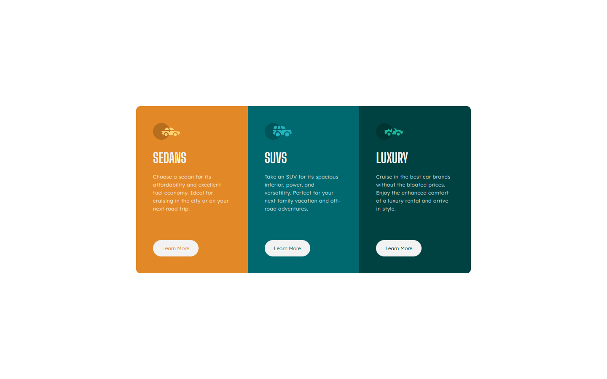

# Frontend Mentor - 3-column preview card component solution

This is a solution to the [3-column preview card component challenge on Frontend Mentor](https://www.frontendmentor.io/challenges/3column-preview-card-component-pH92eAR2-). Frontend Mentor challenges help you improve your coding skills by building realistic projects.

## Table of contents

- [Overview](#overview)
  - [The challenge](#the-challenge)
  - [Screenshot](#screenshot)
  - [Links](#links)
- [My process](#my-process)
  - [Built with](#built-with)
  - [What I learned](#what-i-learned)
  - [Continued development](#continued-development)
- [Author](#author)

## Overview

### The challenge

Users should be able to:

- View the optimal layout depending on their device's screen size
- See hover states for interactive elements

### Screenshot

### Links

- Solution URL: [https://www.frontendmentor.io/solutions/three-column-preview-card-component-using-vanilla-css-and-html-6zOXHvSD4p](https://www.frontendmentor.io/solutions/three-column-preview-card-component-using-vanilla-css-and-html-6zOXHvSD4p)
- Live Site URL: [https://three-column-preview-card-component-ai.netlify.app/](https://three-column-preview-card-component-ai.netlify.app/)

## My process

### Built with

- Semantic HTML5 markup
- CSS custom properties
- Flexbox
- Mobile-first workflow

### What I learned

In this project I practiced my skills in CSS, specifically Flexbox. 
I also tried implemented this project using the Mobile-First Workflow.

### Continued development

In the future I'd like to get more experience working with CSS Grid and using it where it's more appropriate.

## Author

- Frontend Mentor - [@yourusername](https://www.frontendmentor.io/profile/andrijaivkovic)
- Twitter - [@AndrijaIvkovic1](https://www.twitter.com/AndrijaIvkovic1)
